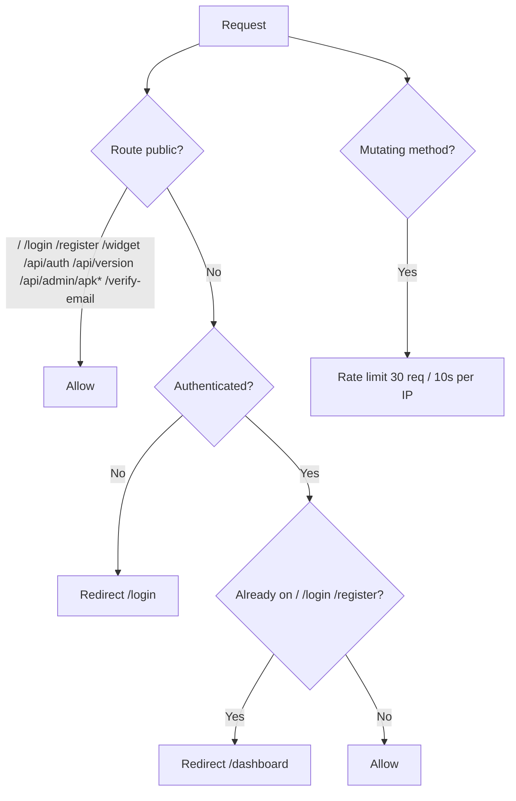
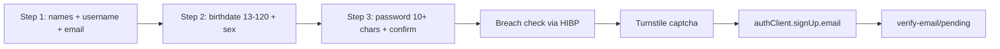
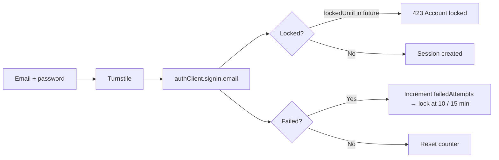
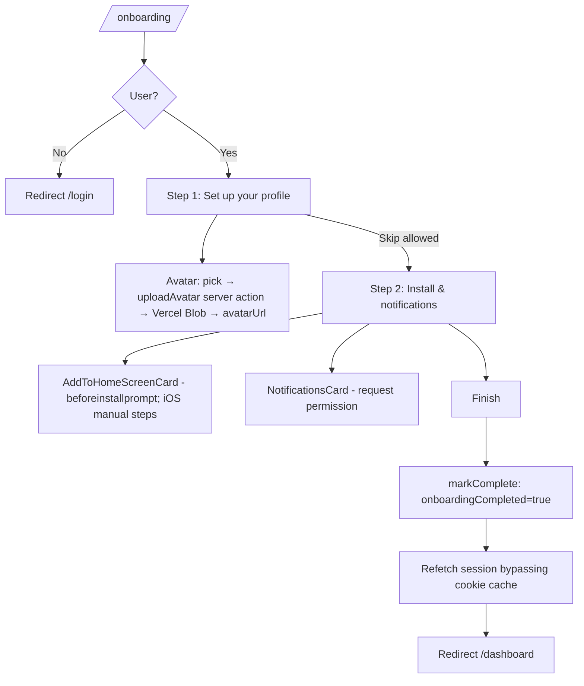
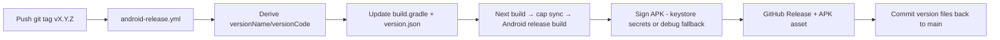

# Schedly — App Flow Structure

> Complete map of how Schedly flows: routes, auth, onboarding, navigation, and every feature's user journey. For technical/architecture details see [`architecture.md`](./architecture.md).

- **Stack:** Next.js 16 (App Router) + TypeScript + Prisma 7 (PostgreSQL) + better-auth + Capacitor 8 (Android) + Vercel Blob
- **Native app:** Capacitor wrapper around the hosted web app (`https://app.schedly.shop`)

---

## Table of Contents

1. [Route / Sitemap](#1-route--sitemap)
2. [Route Guards](#2-route-guards)
3. [Auth Flow](#3-auth-flow)
4. [Onboarding Flow](#4-onboarding-flow)
5. [App Shell & Navigation](#5-app-shell--navigation)
6. [Feature Flows](#6-feature-flows)
7. [Backend / API Flow](#7-backend--api-flow)
8. [Release & Update Flow](#8-release--update-flow)
9. [Theme Flow](#9-theme-flow)
10. [Data Storage Summary](#10-data-storage-summary)

---

## 1. Route / Sitemap

### Route groups

| Group | Routes | Layout | Notes |
|---|---|---|---|
| Public | `/`, `/manifest.ts` | `src/app/layout.tsx` | Landing page is desktop vs mobile split |
| `(auth)` | `/login`, `/register`, `/verify-email/*` | `src/app/(auth)/layout.tsx` | Split-screen branded auth pages |
| `(onboarding)` | `/onboarding` | — | First-login profile setup (own shell) |
| `(dashboard)` | all app pages below | `src/app/(dashboard)/layout.tsx` | Authenticated app shell |
| Public widget | `/widget?token=` | `(dashboard)/layout` (immersive) | No-login shared schedule view |

### Full sitemap

| Route | File | Purpose |
|---|---|---|
| `/` | `src/app/page.tsx` | Landing — desktop: `desktop-landing.tsx`; mobile: swipeable carousel `mobile-onboarding.tsx` |
| `/login` | `src/app/(auth)/login/page.tsx` | Sign in (`login-form.tsx`) |
| `/register` | `src/app/(auth)/register/page.tsx` | 3-step sign up (`register-form.tsx`) |
| `/verify-email/pending` | `(auth)/verify-email/pending/page.tsx` | "Check your inbox" + mail-app deep links |
| `/verify-email/success` | `(auth)/verify-email/success/page.tsx` | Verified; 3s countdown → `/dashboard` |
| `/verify-email/[token]` | `(auth)/verify-email/[token]/page.tsx` | Verifies token then → `/dashboard` |
| `/onboarding` | `(onboarding)/onboarding/page.tsx` | First-login: profile avatar + install/notifications |
| `/dashboard` | `(dashboard)/dashboard/page.tsx` | Today: next-class countdown, today's timetable, due todos |
| `/schedule` | `(dashboard)/schedule/page.tsx` | Schedule management (list → upload → review → view) |
| `/todo` | `(dashboard)/todo/page.tsx` | To-dos (localStorage) |
| `/pomodoro` | `(dashboard)/pomodoro/page.tsx` | Pomodoro timer |
| `/notes` | `(dashboard)/notes/page.tsx` | Notes (localStorage) |
| `/reminders` | `(dashboard)/reminders/page.tsx` | Class reminders timeline from active schedule |
| `/gpa` | `(dashboard)/gpa/page.tsx` | GPA calculator (Philippine 4.0–1.0 scale) |
| `/music` | `(dashboard)/music/page.tsx` | Local music player (IndexedDB) |
| `/design` | `(dashboard)/design/page.tsx` | Immersive schedule design editor |
| `/widget` | `(dashboard)/widget/page.tsx` | Shareable weekly timetable (`?token=`) |
| `/settings` | `(dashboard)/settings/page.tsx` | Account settings (Overview / Account / Security) |
| `/feedback` | `(dashboard)/feedback/page.tsx` | Feedback form → `/api/feedback` |
| `/notifications` | `(dashboard)/notifications/page.tsx` | Notification-style cards from schedules |
| `/admin` | `(dashboard)/admin/page.tsx` | Admin stats + user management |
| `/admin/apk` | `(dashboard)/admin/apk/page.tsx` | APK release publisher |

---

## 2. Route Guards

Guard lives in **`src/proxy.ts`** (Next's new `proxy.ts` middleware convention).



Additional in-app guards:
- **Onboarding gate:** `(dashboard)/layout.tsx` redirects to `/onboarding` while `user.onboardingCompleted === false` (blank loading screen, no dashboard flash).
- **Admin:** `/admin` actions all call `requireAdmin()` (session + `isAdmin`).
- **Immersive mode:** `/design` and `/widget` hide header/drawer/bottom-nav.

---

## 3. Auth Flow

Core: **better-auth** with Prisma adapter. Client `src/lib/auth-client.ts`, server `src/server/lib/auth.ts`, all auth HTTP proxied through `/api/auth/[...all]`.

### Register (3-step wizard)



- Validations: `src/lib/validations.ts` (`registerStep1Schema` / `2` / `3`).
- Breach check: `src/lib/hibp.ts` (SHA-1 k-anonymity → api.pwnedpasswords.com; user may override).
- Captcha: Cloudflare Turnstile (`src/components/turnstile.tsx`, server verify `src/server/lib/turnstile.ts`).
- Sign-up email sent via **Resend** (`src/server/lib/email.ts`), `autoSignInAfterVerification: true`.
- Rate limits: 3 sign-ups / 60s; 5 sign-ins / 10s; global 100 / 60s.

### Login



- Lockout logic: `src/app/api/auth/[...all]/route.ts` (on `POST /sign-in/email`), audit-logged.
- Sessions: 7-day expiry, 60s update age, `__Host-schedly-session` cookie in production.
- Sign out: sidebar dropdown → `authClient.signOut()` → `/login`.

### Email verification

- Clicking the emailed link → `/verify-email/[token]?token=...` → `authClient.verifyEmail()` → `/dashboard`.
- `/verify-email/pending` deep-links into Gmail/Outlook/Yahoo native apps + "Check now" refetch.
- `/verify-email/success` shows 3s countdown → `/dashboard`.

### Session hydration

`useAuth` (`src/features/auth/hooks/use-auth.ts`) hydrates the session client-side after mount (SSR renders session-less to avoid hydration mismatch). Dashboard waits for session before rendering anything.

---

## 4. Onboarding Flow

Entry: first login (or when `onboardingCompleted === false`). `src/app/(onboarding)/onboarding/page.tsx`.



---

## 5. App Shell & Navigation

`src/app/(dashboard)/layout.tsx` + `src/components/sidebar.tsx` + `src/components/bottom-nav.tsx`.

### Navigation config (`src/config/navigation.ts`)

- **primaryNav** (mobile bottom nav): Dashboard, Schedule, To-Do, Reminders, Pomodoro
- **navGroups:**
  - **Main** = primaryNav items (shown in desktop sidebar)
  - **Tools:** Notes, GPA Calculator, Music
- Items support `icon`, `badge`, `adminOnly`, `primary`.

### Shell behavior

| Aspect | Behavior |
|---|---|
| Drawer | Right slide-in; desktop = full nav groups, mobile = Tools/account only (primary in bottom nav) |
| Back arrow | On `/settings`, top-left logo becomes back arrow → `/dashboard`; elsewhere logo = refresh |
| Theme picker | Swatch carousel (3 of 9 visible) in sidebar |
| User menu | Account settings · Help & Feedback · Admin Dashboard / APK Releases (admin) · Sign out |
| Bottom nav | Auto-hides on scroll down (mobile) |
| Immersive | `/design` + `/widget`: no header/drawer/backdrop/bottom-nav |
| Settings | Bottom nav hidden |
| Pull-to-refresh | Browser: native refresh icon shows on pull-down + confirmation dialog; native app: dialog only |
| Status bar | Edge-to-edge overlay, style follows theme (`midnight` → light text) |

---

## 6. Feature Flows

### 6a. Schedule upload — the core flow

State machine in `src/app/(dashboard)/schedule/page.tsx`: `phase ∈ "list" | "upload-select" | "review" | "view"`.

```mermaid
flowchart TD
    L[list] -->|New Schedule| U[upload-select]
    U -->|Take Photo / Choose File| P[Preview: natural-fit image + scan-line animation]
    P -->|Extract Schedule| X[uploadFile → POST /api/upload]
    X -->|client polls GET /api/upload/[id]| AI[AI extraction]
    AI --> R[review]
    R -->|Design Schedule| D[design editor]
    R -->|Save Schedule| S[saveSchedule → list + publish to widget]
    L -->|click schedule card| V[view: SchedulePreview timetable]
    R -.->|remount (return from design)| R2[Resume from sessionStorage]
```

**Upload & AI processing** (`src/features/upload/hooks/use-upload.ts`):
1. `uploadFile` POSTs via XMLHttpRequest to `/api/upload` (real progress events).
2. Server stores file → Vercel Blob (or local fallback), kicks off AI in background (`waitUntil`).
3. Client polls `GET /api/upload/[id]` every 1s (5 min timeout). Statuses: `pending → uploading → processing → completed | failed` (stale >10 min → failed).
4. On `completed`: extracted classes + confidence. Fake counting progress keeps the UI moving during AI work.
5. Scan-line animation overlays the image while reading; the preview shows the photo at its real aspect ratio (no white bars).

**AI pipeline** (`src/server/services/ai.service.ts` + `src/server/lib/ai.ts`):
1. Perceptual hash cache (`src/server/lib/image-cache.ts`, sharp aHash) → cache hit returns instantly.
2. Preprocessing: quality analysis + perspective correction (`src/server/lib/image-processing.ts`).
3. Vision model `google/gemma-4-26b-a4b-it:free` (fallback `nvidia/nemotron-3-nano-omni-30b-a3b-reasoning:free`).
4. Deterministic normalization: days resolved by exact-match map, times → HH:MM, duplicate classes merged (`src/server/lib/extraction-deterministic.ts`).
5. Confidence < threshold → last-resort Hy3 re-validation (`tencent/hy3:free`).
6. Output zod-validated (`src/server/validators/ai.schema.ts`).

**Review** (`src/features/upload/components/schedule-review.tsx`):
- Editable table of classes (subject, code, instructor, room, days, times, color).
- Validation warnings from `src/server/services/validation.service.ts`.
- Add/remove classes; **Design Schedule** → design editor (via `saveDesignState`); **Save Schedule** → `scheduleService.create` → back to list, active schedule published to widget.
- **Persistence:** review state + image saved to `sessionStorage` (`src/features/upload/lib/review-state.ts`) so returning from the design editor resumes the review.

### 6b. Other features

| Feature | File | Flow |
|---|---|---|
| **Dashboard** | `dashboard/page.tsx` | Greeting → next-class countdown → today's timetable (`SchedulePreview`) → today's todos; "Download as image" (html2canvas-pro) |
| **To-Do** | `todo/page.tsx` + `src/features/todo/use-todos.ts` | localStorage CRUD (`useSyncExternalStore`), priorities, due dates, filters, clear completed |
| **Pomodoro** | `pomodoro/page.tsx` | Focus/break minutes, interval ticker, auto phase-swap, progress ring |
| **Notes** | `notes/page.tsx` | localStorage notes (title/body), save indicator |
| **Reminders** | `reminders/page.tsx` | Timeline of upcoming classes from active schedule + "time until start" |
| **GPA** | `gpa/page.tsx` | Courses (units + grade), Philippine scale (4.0–1.0, INC/DRP/FA), target GPA, reset |
| **Music** | `music/page.tsx` | Local player; songs in IndexedDB as base64; upload/play/search/delete, gradient art |
| **Design** | `design/page.tsx` + `schedule-design-editor.tsx` | Draggable class blocks, text tool, background, palettes, layers, undo/redo, export PNG. Reads `design-state` from sessionStorage |
| **Widget** | `widget/page.tsx` | `/widget?token=` resolves user by `widgetToken`; weekly timetable; `publishScheduleToWidget` writes JSON to native Android home-screen widget |
| **Notifications** | `notifications/page.tsx` | Generated client-side from schedules; mark read / delete |
| **Settings** | `settings/page.tsx` + `actions.ts` | Tabs: Overview (profile, avatar, email verify state, delete account w/ username confirm), Account (names/birthdate/sex), Security (change password, sign out everywhere) |
| **Feedback** | `feedback/page.tsx` | Form → `POST /api/feedback` (rate-limited 5/min) |

### 6c. Admin flows

- **`/admin`** — stats (users/schedules/uploads/feedback), user list, toggle admin (requires password re-auth, cannot toggle self).
- **`/admin/apk`** — loads version options from `release/releases.json` + live version from `/api/admin/apk`; Publish → `POST /api/admin/apk-upload` (fetches APK from GitHub raw → Blob → writes `releases/version.json`) with live log console.

---

## 7. Backend / API Flow

### API routes (`src/app/api`)

| Route | Purpose |
|---|---|
| `/api/auth/*` | All better-auth endpoints + login lockout |
| `/api/upload` | Authenticated image upload + background AI trigger |
| `/api/upload/[id]` | Status polling (ownership-checked, stale-processing timeout) |
| `/api/feedback` | Submit feedback (zod, rate-limited, CSRF) |
| `/api/version` | Returns `releases/version.json` (in-app update checks) |
| `/api/csp-report` | CSP violation report sink |
| `/api/admin/apk` | GET current live version |
| `/api/admin/apk-upload` | Publish APK → Blob + version.json |
| `/api/admin/apk-download` | Streams APK (`application/vnd.android.package-archive`) |
| `/api/admin/apk-token` | Blob client-upload token (APK only) |

### Layered backend

```
Route handlers (src/app/api/*)
   → Services (src/server/services/*)
   → Repositories (src/server/repositories/*)
   → Prisma client (src/server/db/client.ts, @prisma/adapter-pg)
```

Key services: `ai.service` (extraction pipeline), `upload.service` (lifecycle), `schedule.service` (create/get/delete + default colors), `validation.service` (class issues), `admin.service`, `feedback.service`. Server libs: `security.ts` (magic-byte image MIME detection, rate limiter, CSRF), `email.ts` (Resend), `audit.ts`, `turnstile.ts`.

### DB models (`prisma/schema.prisma`)

`User` · `Session` · `Account` · `Schedule` · `Class` (days `DayOfWeek[]`) · `Reminder` · `Upload` (status enum, aiResult JSON) · `Notification` · `Feedback`. All user-owned relations cascade on delete.

---

## 8. Release & Update Flow



- **CI** (`.github/workflows/ci.yml`): tsc → eslint → next build → cap sync → unsigned APK artifact. Runs on every push/PR to `main`.
- **In-app update** (`src/features/updates/hooks/use-update.ts` + `src/lib/capacitor-plugins/in-app-update.ts`): native only; checks `version.json` on GitHub raw, then `downloadAndInstall(apkUrl)`.
- `Warmup` pre-warms `/api/version` and `/api/admin/apk` on app start.
- `version.json` (current: `1.4.2` / code `10402`) is mirrored to Blob as `releases/version.json` at publish time.
- Current APKs live in `release/`; version history in `release/releases.json` + `apk/releases.json`.

---

## 9. Theme Flow

- 9 presets (`src/features/theme/presets.ts`): rose (default), ocean, emerald, lavender, amber, teal, coral, slate, midnight.
- `ThemeProvider` + `useThemeConfig()` (external store) persist to `localStorage` + `schedly-theme` cookie (1yr).
- SSR reads the cookie in `src/app/layout.tsx`; dashboard shell applies `themeVars` inline.
- `midnight` is dark; it also flips the native status bar to light style.

---

## 10. Data Storage Summary

| Data | Storage |
|---|---|
| User, sessions, schedules, classes, uploads, notifications, feedback, reminders | PostgreSQL (Prisma) |
| Auth | better-auth (Prisma adapter) |
| Uploaded images / APKs | Vercel Blob (local `public/uploads` fallback) |
| To-dos, notes | localStorage |
| Music | IndexedDB (base64) |
| Theme | localStorage + cookie |
| In-progress review / design state | sessionStorage |
| Extraction cache | Perceptual hash (image-cache) |
